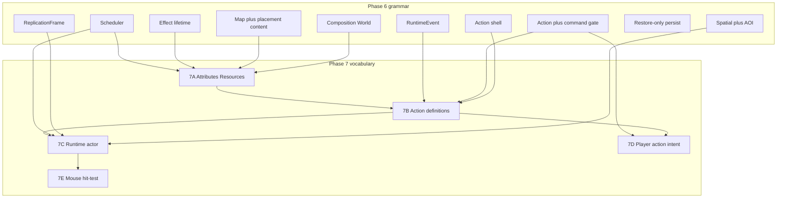

# Phase 7 Preparation — Gameplay Vocabulary

This task writes planning docs only. It does **not** implement Phase 7, does **not** touch the in-progress 6G jitter/AOI investigation, and does **not** mark Phase 6G or Phase 7 complete.

## 1. Repository findings

### Phase numbering is split (must repair in planning docs)

| Source                                                                                                                                            | What “Phase 7” means                                              |
| ------------------------------------------------------------------------------------------------------------------------------------------------- | ----------------------------------------------------------------- |
| [PURGATORY_CURSOR_MASTER_EXECUTION_PLAN.md](PURGATORY_CURSOR_MASTER_EXECUTION_PLAN.md) §14 and [docs/ROADMAP.md](docs/ROADMAP.md) **table** row 7 | Client prediction/reconciliation — **already shipped as 5.3–5.5** |
| 6G notes, [docs/PHASE_6G_REPORT.md](docs/PHASE_6G_REPORT.md), [docs/PHASE_6_EXIT_REVIEW.md](docs/PHASE_6_EXIT_REVIEW.md), ADR-0051                | Next gameplay phase = **MOB / combat AI** — **not started**       |
| Master plan §15–16 / ROADMAP rows 8–9                                                                                                             | Content foundation, then combat core                              |

Living post-6G docs are the intended next-phase pointer. The ROADMAP **table** and master-plan numbering are historical and now wrong: Phase 6 already delivered maps/content (6C), persistence (6E), AOI/interest (6D), and scale harness (5.7/6G). Rows 8–17 must not be treated as the next implementation order.

**No `PHASE_7_*.md` exists.** Closest sketch: [docs/PURGATORY_PHASE_6_CORE_GAME_RUNTIME_FOUNDATIONS.md](docs/PURGATORY_PHASE_6_CORE_GAME_RUNTIME_FOUNDATIONS.md) §4 (ADD MobDefinition/Health/MobSystem). That sketch assumed WindowManager/mouse/selection already existed; 6B closed **without** those.

### What is genuinely ready to consume

Phase 6 grammar (do **not** duplicate):

- Composition `World`, `EntityId` generations, `WorldAddress`, `EntityKind::{Player,Platform,Generic}`
- Scheduler (Critical/Deferred, owner cancel, `CompleteAction` / `ExpireEffect` / `SpawnDue` / `DespawnEntity`)
- Lean Action table + `evaluate_action_gate` + `validate_command_preamble` (`[crates/simulation/src/action.rs](crates/simulation/src/action.rs)`, `[action_gate.rs](crates/simulation/src/action_gate.rs)`, `[command.rs](crates/simulation/src/command.rs)`)
- Staged `RuntimeEvent` (not a bus)
- Effect **lifetime** only (`EffectKind::Test`)
- Spatial queries + AOI + `ReplicationFrame` + `DomainRevs`
- InteractionSession (6B) — distinct from Action (ADR-0046)
- Content maps/placements (`[crates/content/src/schema.rs](crates/content/src/schema.rs)`: maps, entities, portals — **no** actor/stat/action defs)
- Character persist = restore map/point only (`[crates/persistence/src/character.rs](crates/persistence/src/character.rs)`)
- Cadence, spawn schedule, dirty/delta, per-tick budgets, load validation (ADR-0051)

### Unfinished / manual 6G boundaries (do not fix here)

- Automated 6G: GREEN (2026-08-31). Marker still `6G`.
- Manual still required: Mixed/soak, process-ownership, scale ladder, open 6B–6F two-client presentation checks.
- Working-tree investigation (out of scope): local-player jitter, prediction/reconciliation, AOI view-interest.
- Documented debt: CadenceTable not reaped on despawn; `--probe` can touch default persist.

### Architectural smells / contradictions vs code

1. **Generic entities are not on the wire.** `[snapshot_entity](apps/server/src/network/replication.rs)` emits only `PlayerState` → `ReplicatedKind::Player` or `Interactable` → Interactable/Portal. A Transform+visible Generic (6F probe, load spawn churn) **cannot Enter**. Unknown `ReplicatedKind` values are rejected. First visible actor **requires a protocol kind**, not a fake Interactable.
2. **FOOTNOTE locomotion is `PlayerState`.** A walking MOB that reuses `PlayerState` would mix player identity with actors. Phase 7 actor should **not** become a second player body.
3. **Health is a container + wire domain proof, not combat** (`[crates/simulation/src/health.rs](crates/simulation/src/health.rs)`, ADR-0039).
4. **Action/Effect kinds are Test-only.** Production must not depend on them (ADR-0051).
5. **No production UI.** egui overlay + `UIRuntimeState` only (ADR-0016). Mouse is gated and discarded (`[apps/client/src/debug/capture.rs](apps/client/src/debug/capture.rs)`).
6. **ADR-0031:** skills must **not** ride `InputCommand` late-collapse / `jump_pressed` OR.
7. Foundations doc listed WindowManager as a Phase 7 MOB reuse item; it was **never built**. Do not treat that as a missing Phase 6 rewrite — treat it as deferred client work.

## 2. Recommended Phase 7 purpose (one sentence)

**Phase 7 introduces the first content-driven gameplay vocabulary — generalized attributes/resources and executable actions that consume the Phase 6 spine — and proves it with a simple non-player runtime actor and a player-issued action intent, without building combat, inventory, classes, or production UI.**

This is **not** “Phase 7 = MOB AI” and **not** master-plan Phase 9 combat.

Why this vs alternatives:

- **MOB-first only:** ships a dummy Generic; then retrofits stats/actions; still invisible on the wire.
- **Combat-first:** collapses targeting, damage, death, projectiles, threat; invents stats under combat pressure.
- **UI-first WindowManager:** speculative framework with no windows to host (ADR-0016).
- **Attributes-only:** framework with no consumer (anti-overengineering). 7A is only coherent because 7B/7C in the **same phase** consume it.

## 3. Proposed 7A–7E

Keep each stage independently reviewable. Core of the phase is **7A–7C**. **7D** is the player-side proof of generalized costs. **7E** is foundational mouse I/O, not combat.

### 7A — Attributes, resources, modifiers

**Purpose:** Server-authoritative, content-driven vitals that are not class-locked.

**Deliverables:**

- Authored definitions (not Rust enums of “Mana vs Rage”):
  - **Attribute** — named baseline (e.g. Strength). Not a spendable pool.
  - **Resource** — named pool with max, current, regen policy. `mana` is an authored id, not “caster energy.”
  - **Cost** — action-time spend of one or more resources (defined on actions in 7B; 7A only provides the spend/check API).
  - **Regeneration** — scheduler-owned periodic apply, not per-entity polling every 30 Hz tick.
  - **Modifier** — `EffectKind` that adjusts attribute, resource max, or regen while the existing Effect table is alive.
  - **Derived** — computed at read time from attributes + modifiers; not stored as a third persisted number.
- Runtime sheet on entities that opt in (players at spawn from a default content sheet; actors in 7C).
- Keep existing **Health** as the life container (already a replication domain). Do **not** merge HP into the resource map in Phase 7 (would force a health-domain redesign).
- No classes, no equipment, no persistence of current values.

**Dependencies:** Effect lifetime, scheduler, content registry, composition spawn.

**Contracts:** `World` spend/check/regen APIs; dirty only when a replicated field actually changes (7A itself does **not** add a wire domain).

**Client:** none required (sim tests + optional DEV overlay counters later in 7D).

**Server:** attach default sheet on player spawn; regen via entity-owned timers (reschedule on fire). Do **not** use unreaped `CadenceTable` for per-entity regen.

**Protocol:** **none.**

**Content:** new optional packs e.g. `shared/attributes/`, `shared/resources/`; validator: unique ids, non-empty, regen ≥ 0, broken refs fail.

**Tests:** unit (spend/insufficient/clamp); sim (regen on scheduler, effect modifier apply/expire, despawn cancels regen timers); content-validator.

**Manual:** none required.

**Non-goals:** combat damage, death flow, UI bars, persistence, class trees, stacking-rule encyclopedia (use one simple exclusive-per-definition rule).

**Gate:** quality gate + focused sim tests; production paths do not call `EffectKind::Test`.

**6G blockers:** none of the three manual jitter/AOI issues. Still: **do not start until Phase 6G is declared GREEN** (repo phase rule).

---

### 7B — Action vocabulary (server execution)

**Purpose:** Fill the 6F Action shell with content-driven kinds, costs, and cooldown — still not combat.

**Deliverables:**

- `ActionDefinition` content: id, exclusive flag (honor “one Active per owner”), cost list, cooldown ticks, duration ticks (reuse `ScheduledKind::CompleteAction`).
- Replace production `ActionKind::Test` with a compact runtime id resolved from content (keep Test behind load-validation only, ADR-0051).
- Gate extensions: insufficient resource, missing definition, dead/health≤0 (if Health present). Typed denials — no `can_act: bool`.
- Wind-up is **duration + CompleteAction**, not new ActionPhase names (ADR-0046: request/reject stay in the command pipeline).
- Cooldown: entity-owned scheduler job; not a scanned hashmap every tick.

**Dependencies:** 7A, Action table, gates, events, scheduler.

**Client:** none (server/NPC/test start only).

**Server:** `try_start_action` spends costs atomically on success; reject emits `RuntimeEvent::ActionRejected` / command denial.

**Protocol:** **none** in 7B. Do **not** stuff abilities into `InputCommand` (ADR-0031).

**Content:** `shared/actions/` (or server-only if effects are secret). Validator: cost resource ids exist; duration/cooldown bounds.

**Tests:** sim start/busy/cost/cooldown/complete; despawn cancels; Interact still not the exclusive Action slot.

**Manual:** none.

**Non-goals:** projectiles, hit detection, client prediction of actions, dash/charge late-arrival policy (design note only: reliable discrete request in 7D).

**Gate:** quality gate; no protocol golden churn.

**6G blockers:** same as 7A (phase GREEN only).

---

### 7C — First runtime actor (proving MOB)

**Purpose:** Prove a non-player, non-Character entity consumes 7A+7B + spawn/AOI/replication without a fake account.

**Deliverables:**

- `ActorDefinition` / MobDefinition content: presentation id, health max, attribute/resource sheet ref, optional loop action id, respawn delay, collider/half-extents.
- Placement on an existing map (content placement, not hardcoded `World::footnote_test_stage`).
- States: `Idle` / `Acting` / `Dead` (tiny enum). Dead → `schedule_spawn` fresh EntityId (existing contract). **No** behavior trees, pathfinding, aggro, or FOOTNOTE walking.
- Optional cadence-free telegraph: scheduler starts the loop action; transform stays put (avoids 6G movement jitter and `PlayerState` abuse).
- **Wire:** add `ReplicatedKind::Actor` (name TBD: Actor vs Generic). `snapshot_entity` must emit Transform+Health entities that are neither Player nor Interactable. Do **not** masquerade as Interactable.

**Dependencies:** 7A, 7B, spawn schedule, AOI, replication, content placements. **Requires AOI/view-interest GREEN** or actors will falsely vanish.

**Client:** draw replica quads for the new kind; overlay inspector label; interpolation as remote (existing 5.3 path). No actor prediction.

**Server:** instantiate from placements on `ensure_map`; interest same as other visible entities; Health domain already exists.

**Protocol:** **yes — bump** (unknown kind is rejected). Payload can reuse Enter transform + optional health. No combat events.

**Persistence:** actor is runtime-only. Do not persist mob HP or EntityId.

**Tests:** sim spawn/respawn fresh id; sheet attached; action loop; address isolation. Server: Enter/Leave for Actor kind; two observers independent. Content-validator: placement refs.

**Manual:** two clients see the actor in view, Leave when walking away, re-Enter on return (reuses 6F AOI manual). Idle actor must not spam Updates.

**Non-goals:** combat AI, patrol locomotion, NPC dialogue, loot tables, Character bind.

**Gate:** quality gate + two-client AOI visual check. No mandatory 30-min soak; optional Mixed with actor placements is evidence, not the stage definition.

**6G blockers:** **AOI/view-interest GREEN required.** Local jitter/prediction not required for a stationary actor.

**Smell to refuse:** attaching `PlayerState` so `snapshot_entity` treats the MOB as a player; stuffing Test kinds into production.

---

### 7D — Player action intent (reliable command)

**Purpose:** Player can request one authored action that spends a generalized resource. Proves “bow can cost MANA” without combat.

**Deliverables:**

- New reliable `ClientControl` variant e.g. `ActionRequest { request_id, action_id compact, optional target EntityId }`.
- Server: parse/validate → preamble + 7B start; never trust client costs/results.
- Ack/reject on existing reliable control (`ServerControl` denial or a small `ActionResult` with request_id). Prefer explicit typed reject over silent drop.
- DEV keybind or overlay button (not a production hotbar).
- Optional **self vitals** for the local player only (reliable or local-entity domain). Do **not** AOI-broadcast every observer’s mana. If vitals are needed for the DEV overlay, prefer a self-only envelope rather than a new AOI domain.

**Dependencies:** 7B; 7C optional but useful as a visible target later (target field unused or inspect-only).

**Protocol:** **yes — bump** (new control tag). Not an `InputCommand` field.

**Persistence:** none (current resources remain runtime).

**Tests:** protocol goldens for new envelopes (deliberate version bump per PROTOCOL.md); server reject untrusted; Busy/TransitionLocked; rate limit reuse of existing control budgets.

**Manual:** press DEV control, resource drops, action completes, cooldown denies spam; transition barrier still blocks.

**Non-goals:** hotbar UI, skill book, prediction/replay of actions, attack resolution, mouse-to-ability.

**Gate:** quality gate including wire goldens after intentional `PROTOCOL_VERSION` bump.

**6G blockers:** phase GREEN. Do **not** predict this action until a later ADR (ADR-0031). Jitter/prediction GREEN not required.

---

### 7E — Mouse hit-test foundation

**Purpose:** Cursor → UI vs world ownership → hover/select. Not combat, not loot.

**Deliverables:**

- Consume mouse when `gameplay_receives_pointer` is true.
- Screen→world (`Camera` today has `world_to_ndc` only).
- World pick against **replica** AABBs (hover ≠ authority).
- UI-first: egui `wants_pointer` already exists; leave a slot for future production windows.
- Selection/hover client state; E/`InteractOpen` may use selected interactable instead of nearest-only (still server-validated). Clicks do **not** deal damage or pick up items.

**Dependencies:** camera presentation. **Requires local-player jitter/camera GREEN** or world pick will feel broken.

**Protocol:** none if click only retargets existing `InteractOpen`.

**Client-only** except that advisory target changes.

**Tests:** unit for ndc↔world and pointer gate; replica pick prefers closest AABB.

**Manual:** overlay vs world click ownership; hover highlight; select persist until deselect/Leave.

**Non-goals:** WindowManager, HUD, drag-drop, attack-on-click, ground-click move.

**Gate:** quality gate + short visual check.

**6G blockers:** **local-player horizontal jitter + camera follow GREEN.** AOI GREEN so selected entities Leave cleanly.

## 4. Dependency graph (Phase 6 → 7)

| Phase 7 system           | Must use                              | Must not bypass                                                              |
| ------------------------ | ------------------------------------- | ---------------------------------------------------------------------------- |
| Resources regen          | Scheduler, entity owner cancel        | Per-tick full-world scan; wall clock; CadenceTable until despawn-reap exists |
| Action duration/cooldown | `CompleteAction`, Action table, gates | `InputCommand` / jump OR latch                                               |
| Actor spawn/respawn      | `schedule_spawn`, fresh EntityId      | Reuse despawned id; fake Character                                           |
| Actor visibility         | AOI + DomainRevs + new kind           | Full-world broadcast; Interactable masquerade                                |
| Modifiers                | Effect table + `ExpireEffect`         | Parallel buff list                                                           |
| Player ability           | Command preamble + 7B                 | Client-sent damage/cost results                                              |
| Mouse                    | Replica hit-test + existing Interact  | Authoritative client selection                                               |

## 5. Why this decomposition

Independently reviewable slices: data sheet → action machine → visible actor → player verb → pointer I/O. Each has a completion gate. Combat/UI/inventory stay out. Matches Phase 6’s own rule: *grammar then vocabulary*.

## 6. Deliberately deferred beyond Phase 7

Combat resolution, projectiles, threat, targeting lock, death-as-gameplay-loop, inventory/loot/XP, classes, NPC dialogue, pathfinding/patrol AI, production WindowManager/HUD/hotbar, Paper Doll, persisting vitals, accounts, distributed maps, action prediction.

After Phase 7, recast old ROADMAP 8–17 (those rows overlap completed Phase 6 work).

## 7. Protocol / persistence / content

| Concern  | 7A                      | 7B           | 7C                      | 7D                                                 | 7E          |
| -------- | ----------------------- | ------------ | ----------------------- | -------------------------------------------------- | ----------- |
| Protocol | no                      | no           | **v bump: Actor kind**  | **v bump: ActionRequest (+ optional self vitals)** | no          |
| Persist  | runtime-only            | runtime-only | runtime-only            | runtime-only                                       | client-only |
| Content  | attribute/resource defs | action defs  | actor defs + placements | uses 7B ids                                        | none        |

Do **not** bump protocol merely because Phase 7 begins. Combine 7C+7D into one bump only if they ship together; prefer separate bumps if stages merge separately (project historical pattern: v5, v7–v10).

Authored vs derived vs runtime vs persistent:

- Authored: ids, base attributes, resource max/regen, action costs/durations, actor placements
- Runtime: current resource, Active action, modifiers, actor state, EntityId
- Derived: values computed from attributes+modifiers
- Persistent: still restore intent only

## 8. Performance / MMO-scale

- Regen/cooldown = scheduler, not O(N) entity polling.
- Actor AI tick is **not** EveryTick; idle actors are EventOnly replication unless transform/health revs change.
- No global “all actors execute” 30 Hz system.
- Self vitals ≠ AOI broadcast.
- Spatial queries stay address-scoped grid (`SPATIAL_CELL_SIZE_WU`); no O(N²) scans for “nearby MOB.”
- ActionRequest is reliable discrete, not 30 Hz.
- Respect existing scheduler caps (4096 / critical 1024 / deferred 32) and replication frame budget (4096). Queue inventory before new caps ([docs/PHASE_6G_QUEUE_INVENTORY.md](docs/PHASE_6G_QUEUE_INVENTORY.md)).
- Load: extend Mixed with authored actor placements; do **not** make every sub-stage a 30-min soak. Reuse Runtime Validation; keep Test kinds load-only.

## 9. Phase 6G blockers before implementation

Repo rule: **no Phase 7 code until 6G is declared GREEN** (manual issues closed, not only automated gate).

| Issue                       | 7A  | 7B  | 7C         | 7D                     | 7E                              |
| --------------------------- | --- | --- | ---------- | ---------------------- | ------------------------------- |
| Local horizontal jitter     | —   | —   | —          | —                      | **blocks**                      |
| Prediction/recon under load | —   | —   | —          | do not predict actions | —                               |
| AOI / view-interest         | —   | —   | **blocks** | —                      | **blocks** (Leave of selection) |

Also close or consciously waive: 6B E-interact, 6C portal, 6E login manuals if 7D/7E touch those paths. CadenceTable reap is a **prerequisite only if** a stage uses per-entity cadence; 7A should use scheduler instead.

## 10. First implementation task once 6G is GREEN

**7A only:** attribute/resource content schema + validator + `World` sheet + scheduler regen + effect modifiers + sim tests. No protocol, no client, no MOB, no mouse.

## 11. Documentation this prep task will write (after plan approval)

- **Create** [docs/PHASE_7_PLAN.md](docs/PHASE_7_PLAN.md) — canonical Phase 7 design (this document’s substance). Status: **planned, not started**.
- **Update** [docs/ROADMAP.md](docs/ROADMAP.md) table: replace “Phase 7 client reconciliation complete” with the new purpose + `planned (blocked on 6G GREEN)`; add a note that rows 8–17 are stale vs Phase 6 work; keep 6G notes historically intact including “do not begin Phase 7” until 6G closes.
- **Update** [docs/TEST_GATES.md](docs/TEST_GATES.md) later-gates line to point at `PHASE_7_PLAN.md` and keep “do not begin until 6G GREEN.”
- **Do not** change root `PHASE`, [docs/PHASE_6G_REPORT.md](docs/PHASE_6G_REPORT.md), [docs/PHASE_6_EXIT_REVIEW.md](docs/PHASE_6_EXIT_REVIEW.md), prediction/AOI source, or master-plan historical §14.

No Phase 7 ADRs until implementation chooses a protocol bump.

## Out of scope for this prep block

- Any simulation/client/server/protocol code
- Jitter, prediction, AOI investigation files
- Declaring 6G complete
- Starting Phase 7 implementation

