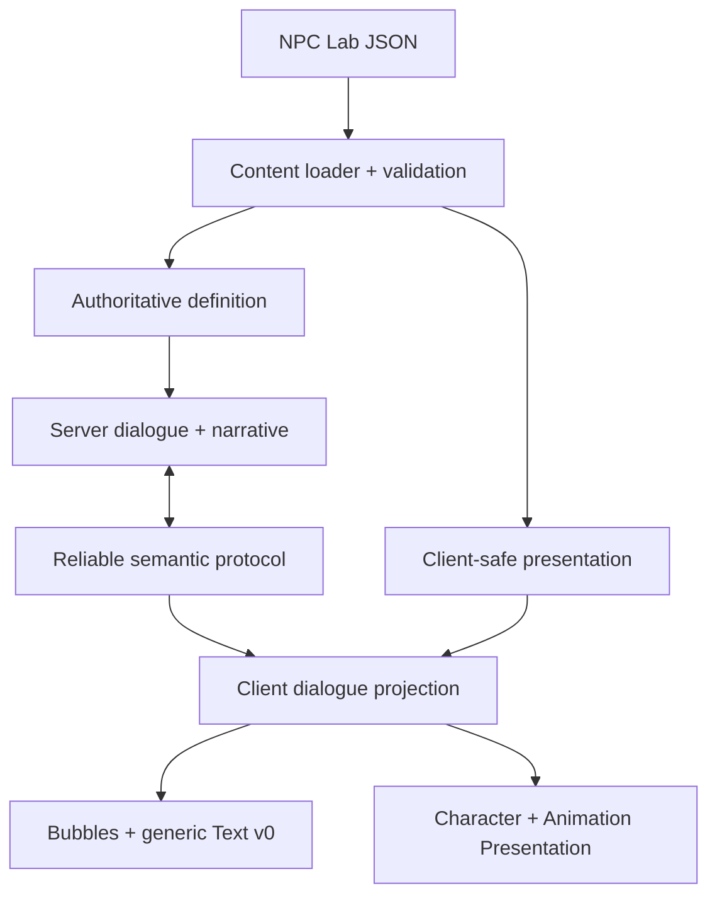

# NPC Dialogue Runtime

Status: current implementation and ownership contract for N10a-N10f.

This document describes the tree on `forge/n10f-local-dialogue-presentation`.
N10a-N10d are merged. N10e is PR #43 and N10f is the stacked PR #45; their
normal client/server proof was accepted on 2026-09-12, but they are not yet on
`master`.

The earlier design rationale remains in
[`NPC_DIALOGUE_RUNTIME_DESIGN.md`](NPC_DIALOGUE_RUNTIME_DESIGN.md). The slice
handoffs are implementation evidence; this document is the current system
reference.

## 1. Scope and terminology

NPC means non-player character. A **Beat** is one authored conversation unit
and one visible NPC bubble. An **ENTRY** Beat can start a new conversation; a
**CONTINUATION** Beat is reached only through an authored choice link.

The runtime supports:

- repository-authored NPC dialogue;
- deterministic, condition-based ENTRY selection;
- server-authoritative per-player progression and actions;
- item and equipment conditions through their existing authoritative owners;
- reliable semantic dialogue messages without dialogue text on the wire;
- native client bubbles, choices, keyboard/mouse input and generic Text v0;
- client-local facing and authored animation cues;
- independent conversations with the same NPC for multiple players;
- development-only transient NPC spawning;
- a short server-side, per-player dialogue reopen cooldown.

It does not introduce a quest manager, scripting language, second interaction
system, second inventory, shared dialogue pose, or dialogue-specific text
renderer.

## 2. End-to-end map



Canonical flow:

```text
content/authoring/npcs/**/*.json
  -> recursive load and validation
  -> authored references resolved to typed indexes/definitions
  -> stable numeric ContentId lookup
  -> server InteractionSession + per-player DialogueRuntime
  -> compact reliable Beat identity
  -> client-safe content lookup
  -> local bubble/text/facing/animation presentation
```

JSON is read during content loading, never interpreted on the simulation hot
path.

## 3. Ownership boundaries

| Concern | Owner | Invariant |
|---|---|---|
| Canonical NPC writing | NPC Lab + `content/authoring/npcs/` | Repository JSON is the source of truth. |
| Validation and typed projection | `purgatory-content` | Runtime consumers query `ContentRegistry`, not JSON. |
| Stable content identity | `purgatory-common` catalog | NPC facets share one numeric `ContentId`. |
| World validity and lifetime | `World::try_open_interaction` + `InteractionSession` | The server validates entity generation, address, range and capability. |
| Active conversation position | server `DialogueRuntime` | State is keyed by actor/player, not stored on the shared NPC. |
| Facts, NPC Met and Dialogue Heard | server `NarrativeRuntime` | State is per player and currently transient. |
| Items and equipment | existing `World` Item/Inventory/Equipment owners | Dialogue reads or requests mutations; it does not mirror ownership. |
| Wire semantics | `purgatory-protocol` | Client sends intent/indexes; server owns selection, actions and continuation. |
| Local semantic projection | client `DialogueRuntime` | Server identity is checked against the active interaction before display. |
| Bubble geometry and hits | `speech_bubble`, `choice_bubble`, `dialogue_bubble_layout` | Presentation modules do not own dialogue truth or font layout. |
| Text layout/rasterization | renderer Text v0 | Generic screen-space service with no NPC or dialogue concepts. |
| NPC pose playback | Character/Animation Presentation | Dialogue supplies a local optional override, not a second animation runtime. |
| Development spawning | debug overlay request + server gameplay owner | Client chooses content only; server owns address, position and runtime identity. |

## 4. Identity model

These identities are deliberately distinct:

| Identity | Lifetime | Example/use |
|---|---|---|
| Authored NPC ID | Stable repository reference | `npc.welcome.traveler_stayed` |
| Numeric `ContentId` | Permanent catalog allocation | `20001` for Traveler |
| `EntityId` | One transient live world instance | A placed or DEV-spawned Traveler |
| `InteractionSessionId` | One actor-target interaction | Validates advance, choice and close |
| `ConnectionId` | One network connection | Binds requests to the authoritative player actor |
| `DialogueBeatIndex` | Index into one validated NPC definition | Compact resolved authored Beat order |

An `EntityId` is never NPC content identity. Several live entities may share
the same `ContentId`, and several players may hold different dialogue state for
the same live entity.

Current Welcome allocations:

| ContentId | Authored ID |
|---:|---|
| `20001` | `npc.welcome.traveler_stayed` |
| `20002` | `npc.welcome.gate_watchman` |
| `20003` | `npc.welcome.shopkeeper` |
| `20004` | `npc.welcome.workshop_craftsperson` |

Allocations are permanent and owned by
[`content/CONTENT_ID_CATALOG.md`](../content/CONTENT_ID_CATALOG.md).

## 5. Authoring contract

One JSON document owns one NPC. Area subdirectories organize files but do not
define runtime identity.

Runtime-relevant shape:

```text
schema_version
id
interaction.beats[]
  id
  priority
  entry
  pool
  conditions[]
  lines[] { text, voice?, animation? }
  choices[] { id, text, next?, actions[] }
```

`design`, `relationships`, top-level `notes`, Beat titles and Beat notes remain
authoring context. The runtime loader accepts but does not project them into
authoritative gameplay definitions.

### Typed conditions

Each condition contains exactly one check plus `equals: bool`:

| JSON field | Authoritative read |
|---|---|
| `fact` | Player `NarrativeRuntime` fact |
| `npc_met` | Player `NarrativeRuntime` NPC Met set |
| `dialogue_heard` | Player `NarrativeRuntime` keyed by NPC `ContentId` + Beat index |
| `item_owned` | Existing authoritative Inventory |
| `item_equipped` | Existing authoritative Equipment state |

Conditions in one Beat are combined with logical AND.

### Typed actions

Each action contains exactly one operation:

| JSON field | Dispatch target |
|---|---|
| `set_fact` | `NarrativeRuntime::set_fact` |
| `mark_npc_met` | `NarrativeRuntime::mark_npc_met` |
| `give_item` | Existing inventory grant path |
| `remove_item` | Existing inventory removal path |

Item quantities must be nonzero. Item references must resolve, and a Give Item
quantity cannot exceed the target definition's `stack_limit`.

### Pools and ENTRY selection

Selection is deterministic and matches the NPC Lab reference:

1. consider ENTRY Beats only;
2. require every typed condition to match;
3. apply pool eligibility;
4. select the highest integer priority;
5. keep authored JSON order when priorities tie.

Pool behavior:

| Pool | Current runtime behavior |
|---|---|
| `mandatory` | Eligible when conditions match |
| `repeatable` | Eligible when conditions match |
| `once` | Suppressed after that Beat is Heard |
| `lore` | Suppressed after that Beat is Heard |
| `rare` | Never auto-selected; cadence is intentionally undefined |

Explicit `choice.next` links resolve to `DialogueBeatIndex` values during load.
They follow the named continuation directly and do not rerun ENTRY selection.

### Beat and line semantics

One Beat is the progression/display unit. All nonempty `lines[].text` values
are joined in authored order with a blank line between them and shown in one
NPC bubble. They are not separate advance steps.

The protocol retains `line_index` for v25 compatibility, but the Beat-based
runtime sends zero. Consequently the current local animation cue is resolved
from the first authored line in the Beat; there is no within-Beat cue change.

`voice` is accepted as authoring data but is not projected into gameplay or
played. `animation` is client-safe presentation data and never a server
gameplay dependency.

## 6. Loading, validation and projections

`load_registry` recursively scans `content/authoring/npcs/`, sorts paths for a
stable load order, parses every document, validates cross-NPC references, then
projects numerically allocated NPCs.

| Load mode | NPC data available |
|---|---|
| `LoadMode::Shared` | Client-safe Beat text, choice labels and optional animation cues |
| `LoadMode::Full` | Shared projection plus authoritative conditions, pools, continuations and actions |

Only NPC IDs allocated in the numeric catalog enter either runtime registry.
The full server pack additionally loads matching server entity definitions and
placements. Entity and dialogue facets with the same authored ID must resolve
to the same numeric `ContentId`.

Validation rejects, among other failures:

- unsupported schema versions and unknown runtime fields;
- malformed authored IDs or wrong ID namespace/domain;
- duplicate NPC IDs, Beat IDs or choice IDs;
- an empty Beat, empty line text or empty animation ID;
- broken local `next` links;
- malformed multi-kind conditions/actions;
- missing NPC/Beat references;
- missing item references and invalid item quantities;
- Social NPC entity definitions without a numeric NPC allocation;
- identity mismatches between NPC dialogue and entity facets.

Content failure is aggregated into structured `ValidationIssue` records and
prevents registry construction.

## 7. Social NPC world integration

A Social NPC is one capability-composed runtime entity:

- stable NPC `ContentId`;
- Transform and `WorldAddress`;
- visible entity;
- `InteractableKind::Npc`;
- an existing all-empty Equipment domain as the current humanoid presentation
  facet.

It replicates as `ReplicatedKind::Npc`, not as the magenta generic
`Interactable`. On the client, `ReplicatedKind::Npc` plus `Some(equipment)`
selects humanoid Character Presentation; combat NPCs without the Equipment
domain retain their sprite path. This marker is a presentation integration
convention, not interaction authority.

Only Traveler is authored into the live development map placement at present.
The other allocated Welcome NPCs are available through the DEV NPC Spawner.

## 8. Server open and progression flow

### Open

1. The client selects the nearest replicated candidate as advisory input.
2. The server resolves the connection's actor and rejects blocked command
   state.
3. A Social NPC request inside that player's reopen window is rejected as
   `Unavailable`; no `InteractionSession` is created.
4. `World::try_open_interaction` validates live generation, actor/target
   lifecycle, `WorldAddress`, distance and `Interactable` capability.
5. The server resolves target `EntityId -> ContentId -> NpcDialogueDefinition`.
6. A new dialogue evaluates ENTRY selection from authoritative per-player
   conditions. An existing matching session resumes its active Beat.
7. Server `DialogueRuntime` stores one `ActiveDialogue` keyed by actor and the
   server locks that player's gameplay input consumption.
8. The server emits `ServerInteract::Opened/Updated`, then
   `ServerDialogueLine` for the active Beat.

If no valid runtime definition or eligible ENTRY Beat exists, the interaction
is closed and the client receives `Unavailable`.

### Advance without choices

`DialogueAdvance` must match the player's live interaction and active dialogue
session. A no-choice Beat is marked Heard, the interaction closes, dialogue
state is removed, input unlocks and the reopen cooldown starts.

If the Beat has choices, Advance does not choose for the player; the current
Beat remains active until a validated choice arrives.

### Choose

`DialogueChoose` is accepted only when actor, session, NPC definition, Beat
index and choice index all match current authoritative state.

The server then:

1. creates a choice plan without mutating dialogue progression;
2. resolves the entire action list and preflights its inventory effects;
3. executes typed actions in authored order through their domain owners;
4. marks the accepted Beat Heard;
5. commits either the authored continuation or completion;
6. emits `DialogueChoiceAccepted` followed by the next `DialogueLine`, or a
   normal interaction close for a terminal choice;
7. sends a fresh owner-private Inventory snapshot when item state changed.

Failed resolution/preflight applies no earlier narrative action and does not
commit the choice.

## 9. Completion, cancellation and cooldown

Closing and completing are different operations.

| Event | Heard mutation | Action rollback | Session result |
|---|---|---|---|
| Valid no-choice advance | Mark current Beat | Never | Close |
| Valid choice | Mark chosen Beat after actions succeed | Never | Continue or close |
| `ESC` / requested close before completion | None | Already accepted actions remain | Close |
| Out of range | None for incomplete Beat | Already accepted actions remain | Close |
| Target gone/stale | None for incomplete Beat | Already accepted actions remain | Close |
| Address change | None for incomplete Beat | Already accepted actions remain | Close |
| Disconnect | Transient player state is forgotten | No persistence | Close/cleanup |

After a real dialogue is finished/closed through the normal dialogue cleanup
path, the server records `dialogue_reopen_after_tick` in that player's
`PlayerBinding`. For 15 authoritative ticks, roughly 0.5 seconds at 30 Hz, a
new Social NPC open from that player receives the existing
`InteractRejectReason::Unavailable` and creates no session.

The cooldown is:

- per player/connection, not per NPC and not global;
- server-authoritative;
- limited to Social NPC opens;
- not applied to generic interactables;
- reset naturally with the connection binding;
- intentionally represented by an existing rejection reason, so it required
  no new protocol version or client timer.

The client also uses edge-triggered `E`, so holding the key does not generate
continuous open requests. The server guard covers rapid release/press churn and
untrusted clients.

## 10. Narrative state and actions

`NarrativeRuntime` stores, per actor:

- `HashMap<String, bool>` facts;
- a set of authored NPC IDs marked Met;
- a set of `(NPC ContentId, DialogueBeatIndex)` Heard entries.

The state is initialized when the player actor is spawned and forgotten when
that actor disconnects. It is not persisted yet. The current Welcome proof
seeds three facts at server player-entry integration:

```text
welcome.workshop.package_needed = true
welcome.workshop.package_at_inn = true
welcome.workshop.package_delivered = false
```

These labels are not hardcoded inside the generic selector or action
dispatcher. Phase 12 persistence can replace the bootstrap with restored
character narrative state without moving dialogue authority to the client.

Inventory actions are preflighted as one ordered batch against a temporary
snapshot before any narrative/item mutation is dispatched. Actual item writes
then use the existing `World` APIs. `Item Owned` and `Item Equipped` likewise
read those existing owners directly.

## 11. Protocol v27

Dialogue uses the reliable bidirectional control stream. It is lifecycle
traffic, not per-tick replication.

| Direction | Tag | Message | Payload excluding tag |
|---|---:|---|---:|
| Client -> server | `35` | `DialogueAdvance { session_id }` | 4 bytes |
| Server -> client | `36` | `DialogueLine { session_id, target, npc_content_id, beat_index, line_index }` | 24 bytes |
| Client -> server, DEV | `37` | `DevSpawnNpc { npc_content_id }` | 4 bytes |
| Client -> server | `38` | `DialogueChoose { session_id, beat_index, choice_index }` | 12 bytes |
| Server -> client | `39` | `DialogueChoiceAccepted { session_id, beat_index, choice_index }` | 12 bytes |

The Phase 6B `InteractOpen`, `InteractClose` and `ServerInteract` messages remain
the outer session/lifetime contract.

Never sent as dialogue authority:

- authored NPC or player text;
- authored actions or conditions;
- authored `choice.next` target;
- animation filenames, frames, bones or timers;
- facts, inventory ownership or client-computed outcomes.

The server sends compact semantic identity. The client must already possess a
validated client-safe content projection and rejects a line that does not match
its active interaction, target, Beat or compatibility line index.

## 12. Client dialogue state and input

The client `DialogueRuntime` holds only local presentation state:

- current semantic `ServerDialogueLine`;
- a buffered continuation while the selected response is visible;
- selected choice index;
- accepted player response and presentation timer;
- a presentation revision used to restart repeated animation cues.

An incoming line is activated only when its session and target match
`UIRuntimeState::Active` and its content identity resolves. Rejected/closed
interactions, screen changes and missing replicated targets clear the relevant
projection.

Input behavior:

| Input | Active dialogue behavior |
|---|---|
| `E` | Advance a no-choice Beat or confirm the highlighted choice |
| Left mouse on NPC bubble | Advance a no-choice Beat |
| Up/Down Arrow | Cycle the highlighted choice with wraparound |
| Left mouse on a choice row | Select and immediately submit that row |
| `ESC` | Use the general interaction close path |

Only one dialogue advance/choice request is sent per client frame. While
dialogue is active, client prediction emits idle input and the server consumes
queued player input as idle. Existing physics still ticks, so external motion
is not converted into a dialogue-specific freeze.

After choice acceptance, the client keeps the selected player response visible
for 1.0 second. An already received authoritative continuation is buffered and
becomes visible when that presentation-only delay expires. Server actions do
not wait for the delay.

## 13. Bubble and Text v0 separation

Dialogue UI is production client rendering, not the egui development overlay.

### Layout consumers

- `speech_bubble` owns NPC/player bubble skin, world anchor, viewport clamp,
  pointer tail and whole-bubble advance hit bounds.
- `choice_bubble` owns one separated row, highlight and exact mouse hit region
  per choice.
- `dialogue_bubble_layout` assigns non-overlapping left/right columns when the
  local player and NPC are visible together. Their columns retain a 16-pixel
  gap even when world positions are close.
- NPC and player response bubbles use different palettes.

Current layout values are client presentation policy: NPC/player speech
bubbles are at most 460 pixels wide; the choice panel is at most 420 pixels
wide; each choice row is 28 pixels high with an 8-pixel gap; screen-edge clamp
uses an 8-pixel safe margin.

### Generic Text v0

Text v0 owns:

- a single embedded UI font;
- one 1024x1024 `R8Unorm` glyph atlas with 64-pixel cells;
- glyph caching and pending GPU uploads;
- font metrics, manual newlines, word/character wrapping and alignment;
- framebuffer-pixel anchors and colors;
- batching multiple `TextBlock` values into one text pass;
- a 4096-glyph per-frame safety bound.

It knows nothing about NPCs, Beats, choices, bubbles, hit testing or dialogue
state. Bubble modules submit ordinary `TextBlock` requests and use the same
layout path available to future production UI consumers.

Text v0 currently supports printable ASCII plus the em dash when present in
the embedded font. Unsupported characters resolve to `?`. It does not yet
provide shaping, bidirectional text, localization, rich spans, fallback fonts
or typewriter timing.

Render order is world/compositor, generic UI rectangles, Text v0, then the
development egui overlay.

## 14. Local facing and animation

The client resolves the active Beat's first line to an optional logical
animation ID. `DialogueAnimationCatalog` recursively scans
`content/shared/animations/**/*.anim`, uses the file stem as the logical ID,
parses clips against Humanoid v0, and exposes them to the existing Character
Presentation set.

Missing or invalid assets are logged and fall back to the ordinary NPC
activity. Duplicate stems are ambiguous, removed from the catalog and also
fall back. Dialogue progression never waits for presentation playback.

For only the client with the active conversation:

- the target Social NPC faces the local player's presented X position;
- the optional dialogue clip replaces the ordinary activity;
- a changed presentation revision restarts the clip even if the authored ID is
  reused;
- closing/clearing dialogue restores ordinary Idle presentation.

No facing, animation, pose or presentation timer is written to shared NPC
state or sent to other clients.

## 15. Multiplayer isolation

Server dialogue and narrative state are keyed by player actor. Client dialogue
state exists only inside that client instance. Therefore two clients may use
the same live NPC simultaneously while displaying different Beats, choices,
facing and animation.

One player's:

- active Beat;
- choice highlight;
- selected-response delay;
- bubble visibility;
- local facing/animation override;
- reopen cooldown

does not lock or mutate the other player's conversation.

## 16. DEV NPC Spawner

The in-window debug overlay builds its combo box from
`ContentRegistry::iter_npc_dialogue_presentations`, so every numerically
allocated and validated runtime NPC appears without a hand-maintained UI list.

`Spawn at Player` sends only `DevSpawnNpc { npc_content_id }`. The server:

1. resolves the bound authoritative player actor;
2. reads its current `WorldAddress` and Transform;
3. verifies both a Social NPC entity definition and dialogue definition exist;
4. builds the entity through `entity_spawn_request`;
5. allocates a transient `EntityId` in `World`.

The client cannot choose coordinates, address or runtime identity. DEV-spawned
NPCs are not written to map JSON, receive no `PersistentId`, remain only in
server memory and disappear on server shutdown. The current safety cap is 64
DEV-spawned NPC instances per server process.

## 17. Failure and cleanup behavior

- Stale session, Beat or choice intents do not advance state.
- Unknown/missing client presentation content clears or rejects only the local
  projection; it does not grant authority to client text.
- Missing dialogue content or no eligible ENTRY causes an unavailable open,
  not a partial live dialogue.
- Range, address and target-lifecycle failures are maintained by `World` and
  emit the existing interaction close reason.
- Target disappearance also clears a client projection when replication no
  longer contains that target.
- Missing/ambiguous animation cues fail locally and never block gameplay.
- A rejected cooldown open returns the client from its in-flight Opening state
  through the ordinary `ServerInteract::Rejected` path.

### Known contract gap: death closure

The original N10 design requires player or target death to close dialogue.
Current `World::validate_interaction` checks active entity lifecycle, address,
range and Interactable capability, but it does not inspect `Health`; the server
gameplay integration also has no explicit dialogue-on-death close hook.

Do not rely on death alone closing a dialogue in the current implementation.
This is a follow-up runtime gap, not a documentation ambiguity. Target despawn,
address change and range invalidation do close it.

## 18. Validation and tests

Focused coverage lives with each owner:

- `purgatory-content`: projection, reference validation, identity, selection
  and Shared/Full separation;
- `purgatory-protocol`: encode/decode, bounds and frozen wire vectors;
- `purgatory-server`: session validation, per-player progression, actions,
  input lock, cleanup, DEV spawning, multiplayer isolation and cooldown;
- `purgatory-client`: semantic projection, input, response buffering, bubble
  geometry/hits, Text v0 and local animation/facing isolation;
- NPC Lab Python tests: authoring validation, selection, pools, preview and
  diagnostics.

Useful focused commands:

```powershell
cargo test -p purgatory-content
cargo test -p purgatory-protocol
cargo test -p purgatory-server
cargo test -p purgatory-client --no-default-features
cargo test -p purgatory-client
cargo check -p purgatory-server -p purgatory-bot-client
cargo run -p purgatory-content-validator -q
py -3 -m unittest discover -s .\tools\npc_lab -p "test_*.py"
```

Official repository gate:

```powershell
.\scripts\check.ps1
```

Passing automated tests does not replace the normal two-client visual proof
for bubble placement, mouse hits, facing, animation and isolation.

## 19. Manual acceptance proof

1. Start the normal server and two clients in the same world address.
2. Approach the placed Traveler and press `E`.
3. Verify the complete authored Beat appears in one NPC bubble and movement
   input is neutralized.
4. Navigate choices with Up/Down + `E`, then repeat using the mouse.
5. Verify each choice has its own highlight/hit row, the selected response uses
   the player palette for 1.0 second, and the authoritative continuation then
   appears.
6. Stand the player close to the NPC and verify the two speakers' bubbles stay
   in adjacent, non-overlapping columns.
7. Complete the Traveler/package flow and verify facts and Inventory affect
   later ENTRY selection.
8. Use the DEV NPC Spawner to instantiate each allocated Welcome NPC at the
   authoritative player location.
9. On both clients, talk to the same NPC at different dialogue positions and
   verify no bubble, choice, facing or animation state leaks.
10. Close and immediately press `E`: the same player must be rejected during
    the roughly 0.5-second server window, while the other player can still
    open. A fresh press after the window must succeed.
11. Move out of range or change world address and verify the incomplete Beat is
    not marked Heard.

Death closure is excluded from GREEN proof until the known gap in section 17
is fixed and covered.

## 20. Deliberately deferred

- persisted narrative facts, NPC Met and Dialogue Heard;
- final bubble art, transitions and responsive text-height sizing;
- typewriter text and within-Beat line progression;
- multiple animation changes inside one composed Beat;
- voice playback, lip sync and facial cues;
- localization, Unicode shaping and fallback fonts;
- controller/gamepad dialogue navigation and key rebinding UI;
- rare-pool cadence/random policy;
- shared/public conversation animation;
- NPC schedules, behavior trees, shops and a quest manager;
- final Welcome map and character art.

## 21. Implementation index

| Area | Primary files |
|---|---|
| Authoring | `content/authoring/npcs/`, `tools/npc_lab/` |
| Numeric identity | `content/CONTENT_ID_CATALOG.md`, `crates/common/src/content_catalog.rs` |
| Projection/selection | `crates/content/src/dialogue.rs`, `loader.rs`, `registry.rs` |
| Social NPC entity | `content/server/entities/npc.*.json`, `crates/content/src/instantiate.rs` |
| World interaction | `crates/simulation/src/interaction.rs`, `world.rs` |
| Server progression | `apps/server/src/network/dialogue.rs`, `gameplay.rs` |
| Narrative/actions | `apps/server/src/network/narrative.rs`, `dialogue_actions.rs` |
| Protocol | `crates/protocol/src/dialogue.rs`, `message.rs`, `docs/PROTOCOL.md` |
| Client projection/input | `apps/client/src/dialogue_runtime.rs`, `app.rs`, `input.rs` |
| Bubble presentation | `speech_bubble.rs`, `choice_bubble.rs`, `dialogue_bubble_layout.rs` |
| Generic text | `apps/client/src/renderer/text.rs`, `ui.rs`, renderer shaders |
| Local animation/facing | `dialogue_animation.rs`, `character_presentation/` |
| DEV spawning | `apps/client/src/debug/overlay.rs`, server `gameplay.rs` |
