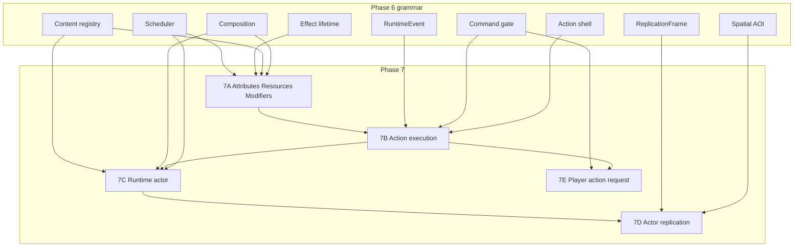

# Phase 7 plan — Gameplay vocabulary

Status: **planned, not started.** Do not implement until Phase 6G is declared GREEN.

This document is the canonical Phase 7 design after Phases 0–6G. It is not an implementation report and does not authorize starting Phase 7.

Legacy roadmap numbering (master-plan Phase 7 = client reconciliation; table rows 8–17 as the next sequence) is **superseded by the post-6G roadmap**. Historical completed work is unchanged: client reconciliation shipped as Phase 5.5; maps/content, persistence, AOI, and scale harness shipped inside Phase 6 / 5.7. See [ROADMAP.md](ROADMAP.md).

---

## Canonical purpose

Phase 7 introduces the first content-driven gameplay vocabulary — generalized attributes/resources/modifiers and executable actions that consume the Phase 6 spine — and proves it with a server-side non-player runtime actor, then network/client presentation of that actor, then a player-issued authored action request.

It does not build combat, inventory, classes, production UI, or a mouse/pointer framework.

---

## Why this phase (and not the alternatives)

Phase 6 built **runtime grammar** (composition, scheduler, Action shell, effect lifetime, events, spatial/AOI, replication, restore persistence). Action and Effect kinds are still `Test` only. `Health` is a container, not combat. Generic entities with Transform are not on the wire unless they are Player or Interactable.

| Alternative | Why not Phase 7 |
|---|---|
| MOB / combat-AI first | Dummy walker; then retrofit stats/actions; still invisible without a replication kind; combat AI is out of scope |
| Combat core first | Collapses targeting, damage, death, projectiles, threat; invents stats under combat pressure |
| WindowManager / production UI first | No gameplay windows to host; egui is not production UI (ADR-0016) |
| Attributes-only | Framework with no consumer |
| Mouse/pointer first | Client interaction infrastructure; not required to prove vocabulary |

Phase 7 is **vocabulary + proof**, in independently reviewable stages.

---

## Phase 6 foundations consumed (do not duplicate)

| Foundation | Role in Phase 7 |
|---|---|
| Composition `World`, `EntityId`, `WorldAddress`, `EntityKind` | Actor and player sheets attach as capabilities, not new storage families |
| Scheduler (Critical/Deferred, owner cancel) | Action complete, effect expiry, regen, actor respawn |
| Action table + `evaluate_action_gate` + command preamble | 7B execution; 7E player request |
| Staged `RuntimeEvent` | Authoritative facts; not a bus; not a second wire codec |
| Effect **lifetime** (`EffectId`, owner, expiry, despawn cleanup) | Hosts content-driven modifiers; not a growing gameplay enum |
| Spatial queries + AOI + `DomainRevs` + `ReplicationFrame` | 7D actor visibility |
| InteractionSession | Unchanged; not merged into Action (ADR-0046) |
| Content registry + placements | Actor/attribute/action authoring |
| Character persist | Restore map/point only; no vitals persistence |
| Cadence, dirty/delta, tick budgets, load validation | Scale; Test kinds stay load-only (ADR-0051) |

ADR-0031: player abilities must **not** ride `InputCommand` late-collapse / `jump_pressed` OR.

ADR-0051: production paths must not depend on `ActionKind::Test`, `EffectKind::Test`, or `ScheduledKind::TestProbe`.

---

## Refined decomposition

```text
7A  Attributes, Resources & Modifiers     gameplay data vocabulary
7B  Content-Driven Action Execution       authoritative actions consuming 7A
7C  Runtime Actor Foundation              server/runtime actor consuming 7A+7B
7D  Actor Replication & Presentation      actor enters the network/client world
7E  Player Action Request                 reliable authored action; generalized costs
```

Mouse/pointer hit-testing is **deferred to Phase 8** (see [Mouse foundation](#mouse-foundation-deferred)).



---

## 7A — Attributes, Resources & Modifiers

**Purpose.** Server-authoritative, content-driven vitals. `mana` is an authored resource id, not caster-class energy.

### Deliverables

- **Attribute** — named baseline (e.g. strength). Not a spendable pool.
- **Resource** — named pool: current, max, regen policy. A bow action may cost the same authored resource as a spell.
- **Cost** — spend/check API used by 7B; not an action definition in 7A.
- **ModifierDefinition** (authored) — which attribute/resource/derived slot, operation, magnitude/policy.
- **EffectInstance** (runtime) — existing effect lifetime: identity, owner, target, expiry. Points at one or more ModifierDefinitions. The Effect system does **not** grow a new Rust `EffectKind` per buff.
- **Derived values** — not persistent. May be computed or cached (see [Derived values](#derived-values)).
- Default sheet attached to players at spawn from content (not a class architecture).
- Keep existing **Health** as the life container and replication domain. Do not merge HP into the resource map in Phase 7.

Closed engine operations (small Rust enum) are allowed: e.g. `Add`, `Mul`, `Override`. Gameplay vocabulary (which resource, which magnitude) stays in content. No expression/script engine.

### Dependencies

Effect lifetime, scheduler, content registry, composition spawn.

### Production / runtime contracts

- `World` APIs: attach sheet, read attribute/resource/derived, try-spend, apply/remove effect that binds modifiers.
- Spend is atomic with the action start that consumes it (enforced in 7B).
- Owner despawn cancels owned regen work and effects.
- Dirty tracking only when a field that 7D/7E later replicate actually changes. **7A adds no wire domain.**

### Client / server / protocol / content

- Client: none.
- Server: default sheet on player spawn; regen per [Regeneration](#resource-regeneration).
- Protocol: **no bump.**
- Content: optional packs (e.g. `shared/attributes/`, `shared/resources/`, `shared/modifiers/`). Validator: unique ids, non-empty, regen ≥ 0, modifier targets exist.

### Testing / manual / non-goals / gate

- Tests: unit spend/insufficient/clamp; sim regen; modifier apply/expire; despawn cleanup; content-validator.
- Manual: none.
- Non-goals: combat damage, death loop, UI bars, persistence, classes, stacking encyclopedia, expression engine, self-vitals protocol.
- Gate: quality gate + focused sim tests. Production must not call `EffectKind::Test`.

### Scale rejects (use instead)

| Reject | Use |
|---|---|
| Every entity EveryTick regen scan | Scheduler-owned regen semantics ([below](#resource-regeneration)) |
| Full modifier walk on every attribute read | Cached derived / dirty invalidation |
| Unbounded timer growth as the Phase 7 contract | Scheduler capacity + future grouping |
| Persist current mana/HP | Restore-only character records |
| Client-authored magnitudes | Content + server apply |

### 6G

Implementation blocked until 6G GREEN. **Planning** does not depend on jitter, prediction, or AOI.

---

## 7B — Content-Driven Action Execution

**Purpose.** Fill the 6F Action shell with content-driven definitions, costs, and cooldown. Still not combat. Still no player network command.

### Deliverables

- `ActionDefinition`: id, exclusive flag (honor one Active per owner), cost list, cooldown ticks, duration ticks.
- Production kinds resolve from content compact ids. `ActionKind::Test` remains load-validation only.
- Duration uses existing `ScheduledKind::CompleteAction`. Cooldown is entity-owned scheduled work, not a scanned map every tick.
- Gate extensions (typed, no `can_act: bool`): insufficient resource, missing definition, busy, transition locked, disconnected, health≤0 when Health is present.
- Wind-up is duration + complete, not new stored `ActionPhase` names (ADR-0046).

### Dependencies

7A, Action table, gates, `RuntimeEvent`, scheduler.

### Client / server / protocol / content

- Client: none. Server/NPC/test code starts actions.
- Protocol: **no bump.** Do not extend `InputCommand`.
- Content: `shared/actions/` (or server-only if costs/effects must stay secret). Validator: resource ids exist; duration/cooldown bounds.

### Testing / manual / non-goals / gate

- Tests: start/busy/cost/cooldown/complete; despawn cancel; Interact is still not the exclusive Action slot.
- Manual: none.
- Non-goals: projectiles, hit detection, client prediction, dash/charge late-arrival policy, player `ActionRequest`.
- Gate: quality gate; no protocol golden churn.

### Scale rejects (use instead)

| Reject | Use |
|---|---|
| Per-tick poll of all cooldowns | Scheduler |
| Abilities on `InputCommand` / jump OR | Discrete 7E command later |
| Client-sent costs/results | Server spend on successful start |
| Second action table beside 6F | Existing `ActionTable` |

### 6G

Implementation blocked until 6G GREEN. No logical dependence on camera/AOI/jitter.

---

## 7C — Runtime Actor Foundation

**Purpose.** A non-player, non-Character entity consumes 7A+7B, spawn/respawn, and simple runtime state **in simulation**. No client presentation. No protocol unless a later finding makes it unavoidable (none known).

### Deliverables

- `ActorDefinition` / MobDefinition: presentation id (unused until 7D), health max, sheet refs, optional loop action id, respawn delay, half-extents.
- Composition: Generic (or actor capability) + Transform + Health + attribute/resource sheet. **Not** `PlayerState`. **Not** a fake Character/session.
- Simple state: `Idle` / `Acting` / `Dead`. Dead → `schedule_spawn` with a **fresh** `EntityId`.
- Authored placement on an existing map (content placements, not `footnote_test_stage` hardcoding).
- Optional server-side action-loop proof: scheduler starts the authored loop action in place (telegraph later). No pathfinding, aggro, or FOOTNOTE walking.

Actors in 7C may exist in `World` and remain **unreplicated**. That matches today’s Generic probe gap and is closed in 7D, not papered over by masquerading as Interactable or Player.

### Dependencies

7A, 7B, spawn schedule, content placements, composition.

### Client / server / protocol / content

- Client: none.
- Server: instantiate on `ensure_map`; sim tests only for visibility.
- Protocol: **no bump.**
- Content: actor defs + placements. Validator: sheet/action refs, placement map exists.

### Testing / manual / non-goals / gate

- Tests: sim spawn; sheet + Health attached; action loop; death → respawn fresh id; address isolation; despawn cancels timers/actions/effects.
- Manual: none (no windowed actor).
- Non-goals: replication kind, client draw, combat AI, patrol locomotion, loot, dialogue, Character bind, protocol.
- Gate: quality gate + sim tests.

### Scale rejects (use instead)

| Reject | Use |
|---|---|
| `PlayerState` so `snapshot_entity` treats a MOB as a player | Actor capability + 7D kind |
| Interactable masquerade for visibility | 7D `ReplicatedKind` |
| Every actor EveryTick AI | Scheduler loop action; idle is quiet |
| O(N²) “all actors vs all players” | Spatial query when a later phase needs nearby checks |
| Reuse despawned EntityId | Existing spawn contract |
| CadenceTable per actor until despawn-reap exists | Scheduler; queue inventory before new caps |

### 6G

Implementation blocked until 6G GREEN. **Planning** does not depend on camera or local-player jitter. AOI is a 7D concern.

---

## 7D — Actor Replication & Presentation

**Purpose.** The 7C actor enters the real network/client world as an explicit non-player replicated kind.

### Deliverables

- `ReplicatedKind` variant for non-player actors (name TBD at implementation: `Actor` preferred over overloading `Generic` if the wire needs a distinct class). Unknown kind values stay rejected.
- `snapshot_entity` encodes Transform (+ existing optional Health domain) for actors that are neither Player nor Interactable.
- AOI Enter / Update / Leave / re-Enter baseline via existing `ObserverReplicationState` + `DomainRevs`.
- Client replica support + placeholder quad presentation (no Paper Doll).
- Remote interpolation uses the existing 5.3 remote path. No actor prediction.

Do **not** AOI-broadcast resource pools. Health may ride the existing health domain when present.

### Dependencies

7C, AOI, `ReplicationFrame`, client replica/renderer. **AOI/view-interest must be GREEN** or actors will falsely vanish.

### Client / server / protocol / content

- Server: include actors in interest set like other visible entities; cadence EventOnly unless transform/health revs change.
- Client: draw; overlay inspector label; Leave clears replica.
- Protocol: **bump required** (new kind). Frozen goldens updated deliberately after `PROTOCOL_VERSION`.
- Content: presentation_id may map to a placeholder color; no new asset pipeline.

### Testing / manual / non-goals / gate

- Tests: protocol goldens; server Enter/Leave; two observers independent commits; idle actor does not spam Updates.
- Manual: two clients see the actor in view, Leave when walking away, re-Enter on return. No mandatory 30-minute soak.
- Non-goals: resource bars, combat FX, mouse pick, locomotion, full-world broadcast.
- Gate: quality gate including wire goldens; short two-client AOI visual check.

### Scale rejects (use instead)

| Reject | Use |
|---|---|
| Full-world actor broadcast | AOI + per-observer commits |
| EveryTick transform Updates while idle | DomainRevs + EventOnly/cadence |
| Replicate all vitals to every observer | Health domain only; resources stay server-side |
| Global dirty consume | `DomainRevs` per observer (ADR-0049) |

### 6G

**AOI/view-interest GREEN is an implementation blocker for 7D.** Local jitter/prediction are not required for a stationary actor, but presentation bugs will confuse the visual check — do not start 7D until 6G is declared GREEN anyway.

---

## 7E — Player Action Request

**Purpose.** Prove `player request → authoritative gate → resource spend → action lifecycle` with a reliable authored command. Generalized costs: the same resource id may be spent by different actions.

### Deliverables

- Reliable `ClientControl` variant e.g. `ActionRequest { request_id, action compact id, optional target EntityId }`.
- Server: untrusted parse → preamble + 7B start. Never trust client costs, damage, or “success.”
- DEV keybind or overlay button (not a production hotbar). Sufficient without mouse.
- **No self-vitals envelope.** Completion does not require the client to display current/max resources. Prefer sim/server tests, existing debug/metrics, and server-side evidence.
- Optional `ActionAck` / typed reject correlated by `request_id` only if the DEV proof cannot otherwise distinguish Started vs Busy vs TransitionLocked. That is command hygiene, not a vitals HUD. Default preference: **omit** unless implementation shows silent drop is untestable from the client; automated server tests remain the authority.

### Dependencies

7B (required). 7C/7D optional (target may be unused). ADR-0031: not `InputCommand`.

### Client / server / protocol / content

- Client: DEV keybind; do not predict the action.
- Server: rate-limit via existing control budgets; transition barrier still denies.
- Protocol: **separate bump** when this stage lands (do not combine with 7D unless both stages intentionally merge in one review).
- Content: reuse 7B action ids (one proving action with a resource cost).

### Testing / manual / non-goals / gate

- Tests: protocol goldens after the bump; server spend on success; insufficient resource / Busy / TransitionLocked; invalid id typed reject.
- Manual: DEV keybind; observe server/debug evidence of start+spend; spam denied on cooldown. No soak required.
- Non-goals: hotbar, skill book, action prediction, attack resolution, mouse-to-ability, replicated mana bars.
- Gate: quality gate + server integration tests. Wire goldens only after intentional version bump.

### Scale rejects (use instead)

| Reject | Use |
|---|---|
| 30 Hz ability spam on `InputCommand` | Discrete reliable request |
| Client-authoritative spend | Server 7B start |
| AOI broadcast of self mana | No vitals wire in 7E |
| Per-player full-world action scan | Owner entity lookup |

### 6G

Implementation blocked until 6G GREEN. Do not predict actions. Jitter/AOI are not logical dependencies of the request/spend proof.

---

## Mouse foundation (deferred)

**Deferred to Phase 8** (or later client-interaction work). Not part of 7A–7E.

Phase 7’s proof is resources, actions, a runtime actor, and a DEV keybind. Mouse hit-testing is client interaction infrastructure. It depends on camera correctness, AOI/view-interest, selection lifecycle, and presentation — including the open 6G local-player jitter and view-interest issues.

A DEV keybind is sufficient for 7E. Keeping mouse in Phase 7 would be convenience, not necessity, and would enlarge the phase without strengthening the vocabulary proof.

When it returns: cursor coordinates, UI vs world ownership (`gameplay_receives_pointer`), screen→world, replica AABB pick, hover/select. Not attack-on-click, not loot, not WindowManager.

---

## Protocol boundaries

Do not bump `PROTOCOL_VERSION` merely because Phase 7 begins.

| Stage | Protocol |
|---|---|
| 7A | No |
| 7B | No |
| 7C | No (runtime only) |
| 7D | **Bump** — explicit non-player replicated kind |
| 7E | **Separate bump** — `ActionRequest` (and ack/reject only if required) |
| Self vitals | **Not in Phase 7** |
| Mouse | None (deferred) |

If 7D and 7E intentionally ship in one review, a combined bump is acceptable. Do not combine merely to reduce version numbers.

`snapshot_entity` today only emits Player or Interactable/Portal. That is why 7D needs a kind, and why 7C must not fake those kinds.

---

## State classification

| Kind | Examples | Persist? |
|---|---|---|
| **Authored** | Attribute/resource/modifier/action/actor ids, base values, regen policy, costs, durations, placements | Content pack |
| **Runtime** | Current resource, Active action, EffectInstance, actor Idle/Acting/Dead, EntityId, timers | No |
| **Derived** | Values from attributes + modifiers (+ policy) | No |
| **Persistent character** | Restore map/point, revision | Yes (unchanged in Phase 7) |
| **Replicated** | Actor transform; optional Health on Enter/Update | Wire, not disk |

Do not persist transient timers, action slots, effect instances, or current mana.

---

## Derived values

Derived values are **not persistent**.

They may be computed from attributes, resources, and active modifiers. They may be **cached at runtime**. If performance warrants, invalidate/recompute **only when dependencies change** (attribute base change, modifier apply/expire, resource-max change).

**Not** a permanent contract of “always compute at read time.” **Not** a design where every read iterates all active modifiers.

7A should keep the read path cheap (O(1) or O(small derived count) after invalidation), not O(active effects) per getter.

---

## Resource regeneration

**Semantics (the contract):** a resource with authored regen increases on simulation time according to that policy, clamped to max, cancelled on owner despawn, not driven by wall clocks.

**7A implementation:** scheduler-owned regeneration is acceptable (entity owner, reschedule on fire).

**Not a permanent implementation contract:** one independent timer per resource per entity forever.

At larger scale the implementation may migrate to bucketed timers, grouped cadence, shared regeneration scheduling, or event-driven batching **without changing gameplay semantics**.

Do not use unreaped `CadenceTable` for per-entity regen until despawn reap exists. Inventory queues before adding caps ([PHASE_6G_QUEUE_INVENTORY.md](PHASE_6G_QUEUE_INVENTORY.md)).

---

## Modifier architecture

```text
EffectInstance  (runtime lifetime, ownership, expiration)
    └── authored ModifierDefinition(s)  (what is affected, operation, magnitude/policy)
```

The 6F Effect table stays the lifetime foundation. Production gameplay must not add `EffectKind::Haste`, `EffectKind::ManaBurn`, etc. as the extension model.

`EffectKind::Test` remains load-only. A content-backed kind (compact definition id) replaces Test on the production path.

No generic expression engine in 7A. Stacking beyond a simple exclusive-per-definition (or last-writer) rule is deferred.

---

## MMO-scale invariants (all stages)

Explicitly reject:

- O(N²) entity scans (use World spatial queries, address-scoped)
- Global broadcasts (use AOI + per-observer `DomainRevs`)
- Every-entity EveryTick gameplay systems (use scheduler / EventOnly replication)
- Unbounded per-entity timers as architecture (scheduler capacity; grouping later)
- Full modifier recomputation on every read (invalidate/cache)
- Client-authoritative costs, damage, or action results
- Actors masquerading as `PlayerState` or Interactable for wire convenience
- Unnecessary replicated vitals (no self-mana envelope in 7E; no AOI resource broadcast)

Respect existing budgets: scheduler 4096 / critical 1024 / deferred 32; replication frame soft 4096. Load: optional Mixed evidence with actor placements after 7D; **not** a 30-minute soak per sub-stage. Runtime Validation remains opt-in evidence.

---

## UI boundary

- Generic WindowManager / production HUD / hotbar: **not Phase 7.**
- Feature UI (skill book, character sheet, targeting chrome): **not Phase 7.**
- DEV overlay and DEV keybind: allowed for 7D inspector labels and 7E proof.
- egui remains development overlay only (ADR-0016).

---

## Explicit non-goals (whole phase)

Combat resolution, projectiles, threat tables, targeting lock, death-as-gameplay-loop, inventory/loot/XP, classes, NPC dialogue, pathfinding/patrol AI, production WindowManager, mouse hit-test, Paper Doll, persisting vitals, action prediction, accounts, distributed maps.

---

## Phase 6G blockers

**Hard rule:** no Phase 7 implementation until Phase 6G is declared GREEN (automated gate already recorded; manual Mixed/soak/process-ownership and the open jitter / prediction / AOI issues still required).

Do not use the planning distinctions below to start code early.

| Stage | Logical planning dependence | Implementation |
|---|---|---|
| 7A | None of jitter / prediction / AOI | Blocked on 6G GREEN |
| 7B | None of jitter / prediction / AOI | Blocked on 6G GREEN |
| 7C | Not camera; not local jitter | Blocked on 6G GREEN |
| 7D | **AOI/view-interest correctness** | Blocked on 6G GREEN; AOI is a real stage dependency |
| 7E | Not jitter; do not predict actions | Blocked on 6G GREEN |
| Mouse | Camera + AOI + selection (if it were in 7) | Deferred — must not block 7A–7E |

Open 6B–6F two-client manuals should be closed or waived before 7D’s visual AOI check so failures are attributable.

CadenceTable despawn reap is a prerequisite **only if** a stage uses per-entity cadence; 7A/7C should use the scheduler instead.

---

## Testing strategy

| Kind | Where |
|---|---|
| Unit | Sheets, spend, derived invalidation, modifier bind, ndc math (when mouse returns) |
| Simulation | 7A–7C World tests; spawn/respawn; gates |
| Protocol | 7D kind goldens; 7E ActionRequest goldens after deliberate version bumps |
| Server integration | 7D observer independence; 7E request→spend |
| Client / manual visual | 7D two-client Enter/Leave only |
| Load / Runtime Validation | Optional after 7D; not every sub-stage; not a 30-minute soak definition |

Reuse `purgatory-content-validator`, existing `phase6f`/`phase6g` test style, and load-mode Test kinds only behind `PURGATORY_LOAD_VALIDATION`.

---

## Completion gates (summary)

- **7A:** quality gate + sim sheet/modifier/regen tests.
- **7B:** quality gate + sim action/cost/cooldown tests.
- **7C:** quality gate + sim actor spawn/loop/respawn tests.
- **7D:** quality gate + protocol goldens + two-client AOI visual.
- **7E:** quality gate + protocol goldens + server request/spend tests + DEV keybind evidence.

Phase 7 as a whole is complete when 7A–7E gates are green and work stopped before combat, inventory, WindowManager, and mouse foundation.

---

## First implementation task (once 6G is GREEN)

**7A only:** attribute/resource/modifier content schema + validator + `World` sheet + scheduler regen (semantics-stable) + EffectInstance→ModifierDefinition + derived cache/invalidation + sim tests.

No protocol, no client, no actor, no `ActionRequest`.

---

## Deferred Phase 8+ candidates (not started, not sequenced here)

Legacy table rows 8–17 remain historical product direction; they are **not** the post-6G implementation order. Likely recast themes:

- Mouse/pointer hit-test foundation (deferred from this phase)
- WindowManager / production game UI (not egui)
- Combat resolution, targeting, damage, death loop
- Actor locomotion (not `PlayerState` reuse) / simple AI
- Inventory, loot, progression
- Persistent vitals if/when they have durable meaning
- Sprite/animation/Paper Doll
- Remaining content-authoring and hardening

Recast those into new phase numbers only after Phase 7 closes.

---

## Remaining design ambiguities (resolve before or at 7A start)

These do not block writing this plan. They should be decided at 7A implementation, not silently:

1. **Default player sheet source** — dedicated content id vs “first resource pack default.” Prefer an explicit authored default sheet id.
2. **Derived cache granularity** — per-entity cached block vs per-derived-slot dirty bits. Either is compatible with the invalidation policy; pick the smaller 7A version.
3. **Modifier exclusivity** — one active EffectInstance per ModifierDefinition per target vs last-writer. Pick one simple rule; do not invent stacking.
4. **7D wire name** — `ReplicatedKind::Actor` vs another identifier. Prefer `Actor`. Do not reuse Player/Interactable.
5. **7E ack** — fire-and-forget `ActionRequest` + server tests vs correlated reject. Prefer tests-first; add ack only if DEV proof is otherwise silent.
6. **Compact ids on the wire** — 7E should send compact runtime action ids, not author strings (same pattern as other protocol compact ids). Confirm at 7E, not 7A.

Health-as-resource unification is **not** a 7A decision; it stays deferred.
