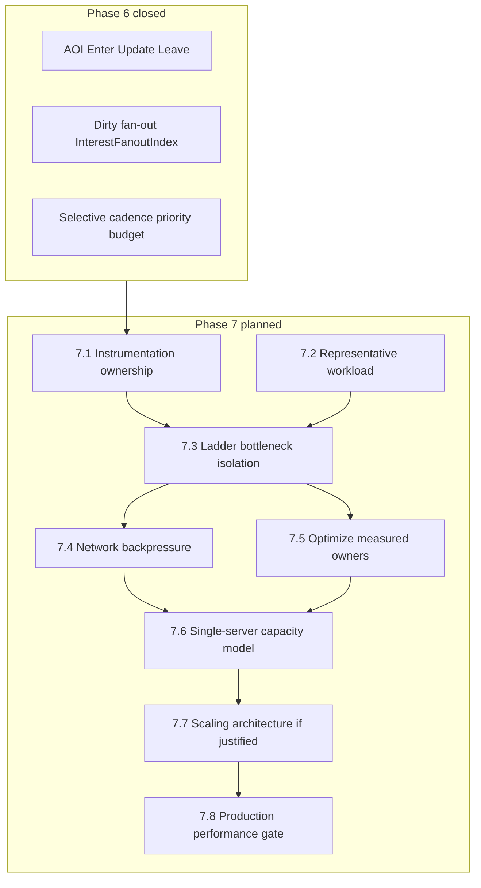

# Phase 7 plan — Capacity, parallelism & production scaling

Status: **7.8 complete — Phase 7 complete** (production performance gate YELLOW; ADR-0056 unchanged). Phase 6 is the closed architectural baseline. Phases 7.1–7.8 are **complete**. Phase 7.8 is **complete** ([`PHASE_78_REPORT.md`](PHASE_78_REPORT.md)). Post-7 Phase **8A** (equipment data model) is a separate slice; this document remains the Phase 7 record.

Legacy roadmap numbering (master-plan Phase 7 = client reconciliation; table rows 8–17 as the next sequence) remains **superseded**. Historical completed work is unchanged: client reconciliation shipped as Phase 5.5; maps/content, persistence, AOI/interest, and scale harness shipped inside Phase 6 / 5.7. See [ROADMAP.md](ROADMAP.md).

A previous post-6G draft treated Phase 7 as a gameplay-vocabulary phase (attributes / actions / runtime actor / player `ActionRequest`). That intent is **superseded**. Vocabulary work is deferred after Phase 7; it is not the purpose of this phase.

---

## Canonical purpose

Phase 7 answers:

**How much real MMORPG workload can one Purgatory server process sustain, what resource becomes the limiting factor first, and what architectural changes are justified by evidence?**

Rule:

**Measure → identify owner → optimize → measure again → redesign only when justified.**

Do not jump to sharding, multithreading, distributed simulation, world splitting, or other large architectural changes before measurement identifies the actual limiting resource.

Do **not** describe this phase as a generic “make AOI scalable” or “implement replication scaling” phase. That architecture closed in Phase 6.

---

## Two connected axes

### A. Capacity and production scaling

Measure and understand tick CPU ownership, process CPU, memory, network throughput, QUIC send behavior, queue pressure, backpressure, replication emit/encode cost, simulation cost, scheduler/actions/effects cost, connection scaling, hotspot density, per-player and per-entity scaling, and saturation behavior.

Objective: an evidence-backed capacity model for a **single server process**.

### B. Representative gameplay workload

Current synthetic/load workloads are useful but cheaper than a real MMORPG. Phase 7 gradually introduces a small set of server-side gameplay systems **because they exercise the runtime**, not because they are content features.

Candidates: basic NPC runtime, simple NPC movement/activity, a minimal combat skeleton, authoritative damage / Health changes, effects / buffs / timed state, scheduler-driven gameplay, spawn / despawn, death / respawn, temporary entities or projectiles, dense player+NPC encounters.

Avoid expanding into quests, crafting, inventory depth, progression, dialogue, large UI, or extensive content production unless a later phase explicitly calls for them.

---

## Phase 6 is closed — do not redo

Phase 6 established and validated:

- spatial AOI / relevance filtering
- Enter / Update / Leave lifecycle
- dirty-domain replication
- delta / selective replication
- cadence tiers and staggering
- coalescing
- observer invalidation improvements
- event-driven update discovery
- `pending_update_ids`
- `InterestFanoutIndex`
- recovery scanning as a fallback rather than normal discovery
- zero idle replication scanning
- priority semantics
- basic byte-budget support
- selective replication correctness
- existing prediction / reconciliation protocol semantics
- scale-ladder validation
- major replication-discovery scaling from 6G.7A / 6G.7B

Production replication **policy tuning** (thresholds, cadences, budgets, slow-client degradation) may happen in Phase 7 using that architecture. The replication **architecture** itself is closed. Do not rebuild AOI, dirty fan-out, or the packer.

Evidence (preserve; do not treat mid-track snapshots as current bottlenecks):

- [`PHASE_6G_REPORT.md`](PHASE_6G_REPORT.md)
- [`PHASE_6_EXIT_REVIEW.md`](PHASE_6_EXIT_REVIEW.md)
- [`MMO_RUNTIME_BASELINE.md`](MMO_RUNTIME_BASELINE.md) (6G.2 freeze)
- [`PHASE_6G2_REPORT.md`](PHASE_6G2_REPORT.md) … [`PHASE_6G7C_REPORT.md`](PHASE_6G7C_REPORT.md)

---

## Starting evidence (not assumed bottlenecks)

Phase 7 starts from measurement, not from an assumed bottleneck.

- The previously observed ~128-client load stall is **not** an established server bottleneck. 6G.2 did not reproduce it as a server-domain hang. Later 6G.7B/C ladders showed replication remaining cheap at 128 (e.g. hotspot selective @128 repl p99 ≈ 1.4 ms) with 0 tick overruns.
- Server-side evidence at 256 under the validated workload was also healthy after 6G.7B/C (hotspot selective @256 tick p99 ≈ 4.8 ms / repl p99 ≈ 1.6 ms). 6G.4’s “256 characterized limit” is a **dated mid-track snapshot** (pre-7A–C), not the Phase 7 starting claim.
- Higher-load saturation / timeouts have **not** been conclusively attributed. The load harness or client side may be involved.

Do **not** invent player-capacity, bandwidth, or tick p95/p99 targets in this plan. Operating envelopes are an output of 7.6 / 7.8, not an input.

When attributing future saturation, distinguish three classes:

1. **Simulation / tick saturation** — authoritative `World` work (movement, scheduler, actions/effects, AOI classify, replication discover/policy/encode) exceeding tick spacing or starving later stages.
2. **Server transport / backpressure saturation** — QUIC send, writer queues, write pressure, slow clients, accumulated outbound work, byte-budget binding.
3. **Load-harness / client saturation** — `purgatory-load` ramp, connect/handshake, prediction pending window (`PREDICTION_PENDING_CAP` remains 128), client stalls, harness timeouts that are not server tick blow-ups.

A timeout at N clients is not by itself a server-capacity claim.

---

## Subphase outline (high-level)

Exact boundaries may be refined when each subphase is designed. Do not implement from this outline alone.

```text
7.1  Capacity Instrumentation & Work Ownership
7.2  Representative Gameplay Workload
7.3  Capacity Ladder & Bottleneck Isolation
7.4  Network Throughput & Backpressure
7.5  Simulation / CPU Scaling
7.6  Single-Server Capacity Model
7.7  Production Scaling Architecture
7.8  Production Performance Gate
```



### 7.1 — Capacity Instrumentation & Work Ownership

Establish trustworthy measurement of where server time and resources are spent. Attribute meaningful portions of runtime cost rather than only total tick duration. Identify the likely owner of future saturation. **No optimization redesign before this evidence exists.**

7.1 **extends existing coarse instrumentation into work ownership / attribution**. It does not build observability from scratch.

Reuse:

- Coarse tick domains already recorded as run artifacts (commands / simulation / gameplay services / spatial-AOI / replication / persist) under `PURGATORY_CAPACITY_ARTIFACT_DIR`
- `replication_fanout.json`, `aoi_locality.json`, process CPU / working-set artifacts
- Existing **schema-3** `PURGSTAT` / runtime metrics contract and existing artifacts

Do **not** bump the metrics schema in documentation or as a silent 7.1 assumption. If 7.1 later requires a schema change, that must be designed explicitly as part of the detailed 7.1 implementation plan.

Likely 7.1 design pressure (not a spec):

- Split the lumped Replication domain (discover vs policy vs encode vs queue vs QUIC send)
- Attribute failures to the three saturation classes above
- Byte budgets exist but did not bind on the 6G.7C ladder (`priority_deferred = 0`)
- Known residual debt that can confuse ownership: CadenceTable not reaped on despawn; `dev.probe` persist; Generic wire visibility shipped in 7.2 as `ReplicatedKind::Npc`

### 7.2 — Representative Gameplay Workload

**Complete** ([`PHASE_72_REPORT.md`](PHASE_72_REPORT.md)). Minimum server-side gameplay runtime for realistic pressure: NPCs, activity, Strike/Health, Pulse timers, lifecycle churn, dense hotspots, wire `ReplicatedKind::Npc` (v11), representative harness presets. Consumed the Phase 6 spine; did not fake actors as `PlayerState` or Interactable; did not reopen AOI architecture.

### 7.3 — Capacity Ladder & Bottleneck Isolation

Controlled scaling across clients, entities, active entities, hotspot density, update frequency, and gameplay activity. Determine which resource limits first. Separate server limits from load-generator / harness limits using the three saturation classes.

### 7.4 — Network Throughput & Backpressure

Investigate and harden send queues, write pressure, QUIC behavior, slow clients, accumulated outbound work, overload behavior, byte budgets, and graceful degradation. Production replication **policy tuning** may happen here on the Phase 6 architecture. Do not rebuild that architecture.

### 7.5 — Simulation / CPU Scaling

**Complete** ([`PHASE_75_REPORT.md`](PHASE_75_REPORT.md)). Accounting Instant gaps closed; `replication_policy` identified as primary growth owner; unattributed residual ~15–25% (timer noise). Absolute headroom remains large (util ≲11% through mixed@128 / dense@64). **No CPU owner optimization accepted** (owners remain cheap vs tick spacing). Parallelism verdict: **No**. Stop before 7.6.

### 7.6 — Single-Server Capacity Model

**Complete** ([`PHASE_76_REPORT.md`](PHASE_76_REPORT.md)). Owner OLS from 7.5 post-accounting cells; policy ~ scanned_per_tick; npc ~ updates_per_tick; whole-tick MAPE ~20% calib / ~22% holdout. Sensitivity: players > overlap > NPC/activity. Parallelism/redesign **not** justified in measured envelope; `replication_policy` first projected limiter. Stop before 7.7.

### 7.7 — Production Scaling Architecture

**Complete** ([`PHASE_77_REPORT.md`](PHASE_77_REPORT.md); ADR-0056). **Decision: remain single-process / single World owner.** No multithreading, parallel replication, sharding, zone servers, or multi-process handoff implemented. Triggers, evolutionary path, ownership, replication-parallelism feasibility, channels/instances readiness, and deferred backlog recorded. Preferred first future horizontal unit: channels/instances. Stop before 7.8.

### 7.8 — Production Performance Gate

**Complete** ([`PHASE_78_REPORT.md`](PHASE_78_REPORT.md)). Canonical workloads + absolute/baseline thresholds; `scripts/phase_78_gate.ps1`; frozen baseline under `logs/load/capacity_78/baseline/`. Gate verdict **YELLOW** (harness snapshot-starvation WARN; absolute PASS). Soak 8m hotspot@32+NPC completed. ADR-0056 unchanged. **Phase 7 complete.**

---

## Explicit non-goals (whole phase)

- Re-planning or re-implementing Phase 6 AOI / replication architecture
- Sharding, distributed simulation, or world splitting before 7.7 is justified
- Multithreading as a default, rather than a measured response
- Full combat/AI product, quests, crafting, inventory depth, progression, dialogue, large UI, extensive content
- The superseded gameplay-vocabulary plan (7A attributes/resources/modifiers → 7B action execution → 7C runtime actor → 7D actor replication → 7E player action request / mouse)
- Invented numeric capacity or budget targets
- Raising `PREDICTION_PENDING_CAP` or admission as a “fix” for unattributed timeouts
- Metrics schema bump as part of planning docs

---

## Deferred after Phase 7

Not sequenced here. Recast after 7.8:

- Content-driven attributes / resources / modifiers and a full action vocabulary
- Player-issued authored `ActionRequest` (still must not ride `InputCommand` / jump OR — ADR-0031)
- Mouse / pointer hit-test foundation
- WindowManager / production game UI (egui remains overlay-only — ADR-0016)
- Combat as a complete game system beyond the 7.2 skeleton
- Inventory, loot, progression, persistent vitals
- Sprite / animation / Paper Doll
- Horizontal scaling (only if 7.7 cites evidence)

A MOB / actor must still consume the generic Phase 6 spine without a fake Character/account/session. That remains an exit-review invariant, not a reason to make vocabulary the Phase 7 purpose.

---

## Protocol / persistence

Do not bump `PROTOCOL_VERSION` merely because a Phase 7 sub-stage begins. 7.2 required and shipped an incompatible bump to **v11** for `ReplicatedKind::Npc` (ADR-0054). Further bumps need their own compatibility review.

Character persist remains restore map/point only unless a later subphase explicitly changes it.

---

## First implementation task (once Phase 7 is instructed to start)

**7.1–7.8 (complete).** **Phase 7 complete.** Gate: [`PHASE_78_REPORT.md`](PHASE_78_REPORT.md). Post-7 work starts at **8A** (equipment data model), not from this document.
